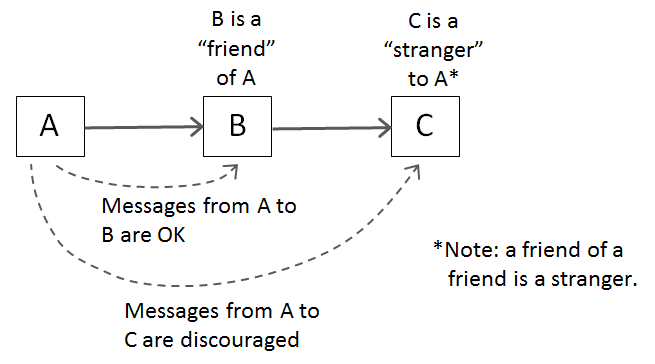

# Capítulo 6 - Objetos e Estruturas de Dados

> There is a reason that we keep our variables private. We don’t want anyone else 
> to depend on them. We want to keep the freedom to change their type or
> implementation on a whim or an impulse. Why, then, do so many programmers  
> automatically add getters and setters to their objects, exposing their private 
> variables as if they were public?

## Abstração de dados

Faça uma classe e exponha sua abstração na interface e não os seus detalhes 
de implementação. **Não adianta apenas deixar as variáveis de classe privadas 
e acrescentar _setters_ e _getters_**. É preciso dedicar um tempo para pensar
em como representar os dados que um objeto contém.

O usuário vai manipular a essência desses dados.

```java
// Expõe detalhes de implementação!!!
class Point {
  double x;
  double y;
}
```

```java
// Esconde detalhes de implementação 
// e expõe a abstração de um ponto 
// através da interface pública.
class Point {
  private double x;
  private double y;
  void setCartesian(double x, double y);
  void setPolar(double r, double theta);
  double getR();
  double getTheta();
}
```

## Anti-simetria dado-objeto
_Não entendi ainda. Vou ter que reler._

## Lei de Demeter
Um módulo não deve saber sobre o funcionamento interno dos objetos que ele 
manipula.

O método `f` de uma class `C` pode apenas chamar um desses métodos:
- `C`
- Um objeto criado por `f`
- Um objeto passado como argumento para `f`
- Um objeto dentro de uma variável de instância de `C`

[Artigo Wikipedia](https://en.wikipedia.org/wiki/Law_of_Demeter).



[Fonte da imagem](https://betterprogramming.pub/demeters-law-don-t-talk-to-strangers-87bb4af11694#:~:text=Demeter's%20law%20is%20known%20as,talk%20to%20your%20immediate%20friends.)


Considere o seguinte trecho de código:
```java
// Retirado de algum lugar do framework Apache
final String outputDir = ctxt.getOptions().getScratchDir().getAbsolutePath();
```

Se `ctxt` é um objeto, deveríamos pedir pra que ele _fizesse_ algo, e não 
perguntando sobre seus detalhes internos.

Mais embaixo no mesmo módulo:

```java
String outFile = outputDir + "/" className.replace('.', '/') + ".class";
FileOutputStream fout = new FileOutputStream(outFile);
BufferedOutputStream bos = new BufferedOutputStream(fout);
```

Descobrimos que a intenção original do autor era acessar o caminho absoluto do
diretório scratch para criar um arquivo scratch com um dado nome. _Isso_ é um 
**comportamento** razoável para objeto `ctxt`, que permite o objeto esconder
seus detalhes internos e prevenir a função atual de violar a Lei de Demeter.

Podemos reescrever o comportamento assim:
```java
BufferedOutputStream bos = ctxt.createScratchFileStream(classFileName);
```


## Data Transfer Objects (DTO)
Forma de estrutura de dado com variáveis públicas e sem métodos.

## Conclusão

_Uma tradução direta do livro:_
Objetos expõem comportamento e escondem dados. Isso deixa mais fácil adicionar 
novos tipos de objetos sem mudar comportamentos que já existem, além de deixar mais difícil de adicionar novos comportamentos para objetos que já existem.

Estruturas de dados expõem dados e não tem comportamentos relevantes. Isso deixa mais fácil adicionar novos comportamentos para estruturas existentes, mas deixa mais difícil adicionar novas estruturas de dados para funções existentes.

Bons desenvolvedores de software sabem quando é melhor usar um ou outro.


---
[<< Capítulo 5 - Formatação](./../chap5_Formatting/README.md) 
|
[>> Capítulo 7 - Tratamento de Erros](./../chap7_ErrorHandling/README.md)

[• Início](../../README.md)
